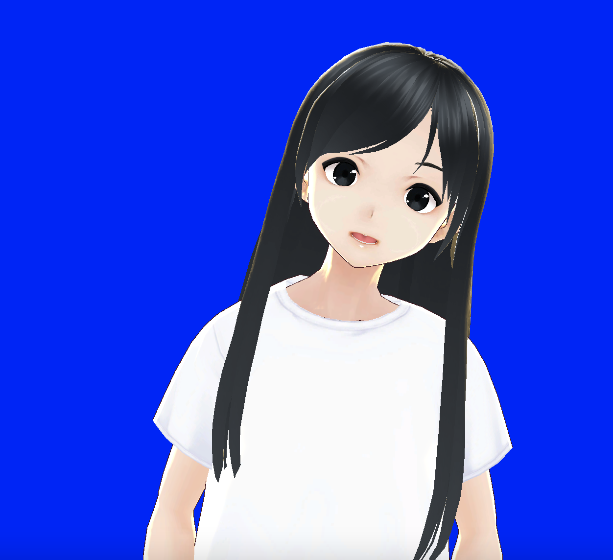
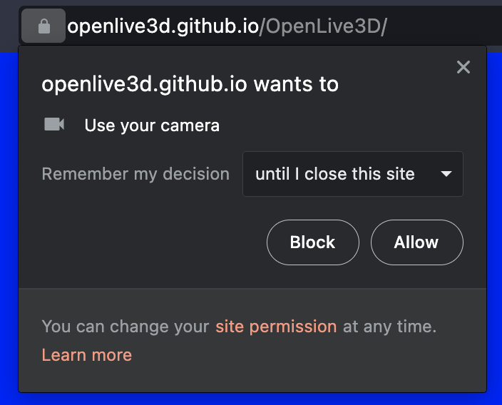
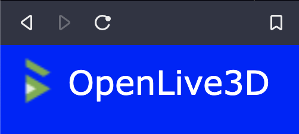
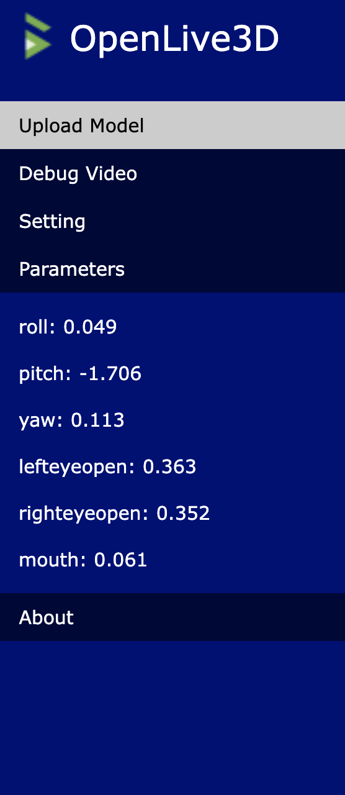
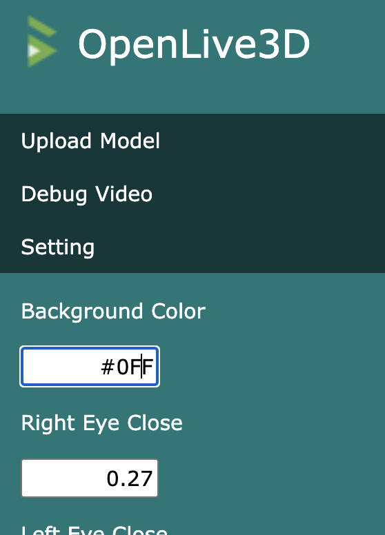

# OpenLive3D

The open source project for Live3D Virtual Avatar.

## Features

The project aims to connect the half-body movement with facial landmarks to the 3D `VRM` avatar.

 - Facial landmark model based on `TF.js`
 - Adjustable config to map landmarks to the avatar
 - Rich documentation
 - Modularized and flexible structure

## Step by Step Guide:

1. Open the OpenLive3D website: https://openlive3d.github.io/OpenLive3D/

2. Allow the camera capture

3. Wait for 10 seconds
 - Avatar VRM Model Loading
 - Machine Learning Motion Tracker Connection

4. Click the OpenLive3D LOGO on the Top Left
 - Open the System Menu

5. Upload your own VRM file

6. Change the setting if you would like

## Project Architecture

 - Media Source Manager
 - Facial Landmark Recognizer
 - Model Manager
 - Controller
 - Effect Manager
 - State Manager
 - Config Manager
 - Live3D GUI

## Development Status

Currently, the project is in its initialization state.

 - Initial documentation
 - Placeholder files creation
 - MVP Design

## Development Logs

 - 2021-08-26: Project creation
 - 2021-08-29: [Create MVP Development Plan](log/2021-08-28-MVP-Development-Process.md)
   - Complete: Show Camera on Screen
   - Complete: Show Landmarks and Info
 - 2021-09-08: [Create Word Definition](log/2021-09-08-Word-Definition.md)
 - 2021-09-09: [Create Dependencies](log/2021-09-09-Dependencies.md)
   - Complete: Show Avatar
 - 2021-09-10: MVP Scope add Avatar Link
   - Complete: Operate Avatar
 - 2021-09-12: three.js:v0.132.2 three-vrm:v0.6.6
   - Complete: Avatar and Landmark Info Link
 - 2021-09-15: [Create Alpha Development Plan](log/2021-09-15-Alpha-Development-Process.md)
 - 2021-10-02: Config Establishment
   - Complete: Module / Code Re-organization
 - 2022-03-06: Default Pose, Pose Limiter
   - Complete: Eyes Link
 - 2022-03-08: VRM Model Upload
 - 2022-03-11: W3CSS Frame Beautify
 - 2022-03-12: Add About: Alpha Test
